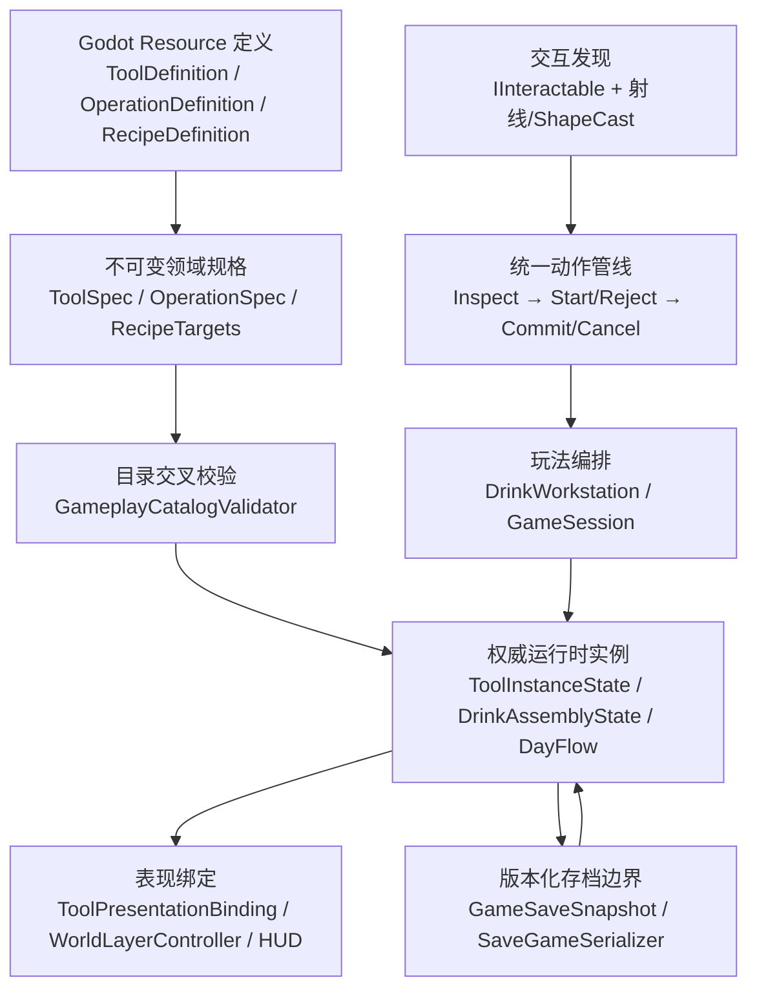

# 《眼镜酒馆》结构审查与总体架构

审查日期：2026-07-29

范围：交互架构、物品系统、配方系统、工序系统、存档系统、眼镜系统，以及定义/实例、交互/动作、玩法状态/视觉表现、动作过程/玩法状态的边界。

## 结论

当前 M0 已从“功能可运行的集中式原型”推进为“有明确领域边界、统一动作入口和版本化状态快照的可扩展原型”。本轮没有改动正式配方、平衡值、顾客内容或最终美术。

已完成的关键纠错：

- 修复跨天后 `TotalWaste` 未清零，避免前一天浪费污染下一天统计。
- 修复评价读取历史累计原料/完成度的问题；当前评价会从当前高球杯实例重建，倒掉旧饮品后旧数据不会污染重做结果。
- 将工具玩法实例 `ToolInstanceState` 与 Godot 节点 `ToolPresentationBinding` 分离；工具位置成为可测试、可保存的权威实例状态。
- 建立统一 `GameplayActionPipeline`，玩家发出的交互、切镜、简易工序、量酒器切换、连续工序和跨天命令均经过“检查 → 开始/拒绝 → 提交/取消”生命周期。
- 建立版本化 `GameSaveSnapshot` 与 JSON 序列化/校验；当前 M0 权威状态、工具内容/位置、玩家姿态和柜体开合可往返恢复，不保存 Node、材质、Tween 或提示文本。
- 为工具/工序目录增加稳定 ID、分类、引用、输入、输出和结果容器的交叉校验；为配方步骤/原料与工序输出增加兼容性校验。
- 将“是否为原型”和“是否启用数量评分”拆成两个定义字段，避免内容状态与评分策略互相污染。
- 删除未参与运行逻辑的旧交互枚举、工具定义字段和重复容器状态类型。

## 审查后重构进展

2026-07-29 已完成 `DrinkWorkstation` 前三批职责迁移：

- 新增无 Godot 依赖的 `ToolInventoryService`，接管工具实例集合、左右手槽、拿放、防重叠、砧板槽、材料装载/板上转移、每日重置及工具快照往返。
- 新增无 Godot 依赖的 `ProcessExecutionService`，接管工序目录、能力/选择、来源合并、规则鉴定、成功输出、失败废品、重复补救、溢出与工序统计；以类型化 outcome 交给 facade 格式化反馈。
- 新增无 Godot 依赖的 `DrinkAssemblyState`，接管当前杯液体、饮品统计、丢弃/重做、评价输入、每日重置和 schema version 1 工作台快照映射；`LiquidContainer` 同步迁入纯 Domain。
- `ProcessExecutionService` 不再接收可替换液体目标或直接改写 `DrinkSnapshot`，只向稳定的 `DrinkAssemblyState` 提交工序结果。
- `DrinkWorkstation` 保留原有公开 API，转为 Godot signal facade、工具表现同步、反馈文本与跨服务编排入口；玩法逻辑、提示语义和随机数消费时机未改变。
- 新增 11 项纯领域测试覆盖三批服务；完整回归现为领域 27/27，资产、Debug/Release、Godot 导入、冒烟、输入和流程全部 PASS。
- `GrayboxLevelBuilder` 已按审查结论拆成不可变 `BarLayoutDefinition`、无玩法状态的 `GrayboxArchitectureBuilder`、柜体节点组装 `CabinetBuilder` 和玩法绑定 `GameplaySceneComposer`；原类只保留组合顺序与兼容常量。
- 布局定义新增稳定 ID、唯一性、正尺寸、三槽砧板、单一冰桶抽屉和水槽下方净空校验；完整回归仍为领域 27/27 及所有 Godot 测试 PASS。
- Forward+ 布局最终帧与重构前已验收基线 SHA-256 完全一致，证明节点、几何、材质和画面未发生漂移。
- 下一拆分目标是 `PlayerController`；前四批完成仍不等于全部架构重构完成。

表现系统边界同步锁定：Gameplay 只允许通过事件、signal 或动作结果通知表现层，不得直接依赖或控制动画、IK、Skeleton/Bone 等表现实现；表现层不得反向决定玩法结果。

## 总体分层

依赖方向：

1. 定义生成规格，规格经过校验后才允许创建实例。
2. 交互只发现“玩家现在想对谁做什么”；动作管线统一检查和提交。
3. 编排层可以修改权威实例；表现层只能读取实例并重建画面。
4. 存档只序列化权威实例和会影响玩法的场景实例状态，不序列化表现对象。

## 四组核心边界

### 定义与实例

定义回答“这一类东西是什么”：

- `ToolDefinition`、`OperationDefinition`、`RecipeDefinition` 是可编辑 Resource。
- `ToolSpec`、`OperationSpec`、`RecipeTargets` 是运行时不可变规格。
- 稳定 ID、能力、分类、输入输出、原型标记和评分策略属于定义。

实例回答“当前这一件东西处于什么状态”：

- `ToolInstanceState` 保存唯一工具实例的位置、手位、砧板槽、内容物、废品标记、完成度和量酒器端位。
- `DrinkAssemblyState` 持有 `LiquidContainer`，统一保存当前杯液体、饮品统计、评价输入与存档映射。
- `GameSession`/`DayFlow` 保存当前天、阶段、世界模式与是否已观察配方。

禁止事项：

- 不把 Godot Node、Mesh、Material、Tween 放进定义或权威实例。
- 不在表现节点上另存一份手位、内容物或完成度。
- 不用显示名代替稳定 ID 建立引用。

### 交互与动作

交互负责发现与说明：

- 射线/ShapeCast 找到 `IInteractable`。
- `CanInteract`、提示和不可用原因是只读检查，不得修改玩法状态。
- `GetActionDefinition` 把交互映射为稳定动作 ID。

动作负责状态变更：

- `GameplayActionPipeline` 是玩家命令的统一入口。
- 瞬时动作在 `Execute` 后提交；连续动作只在 `CommitActive` 时提交。
- 拒绝和取消不提交玩法状态；每次阶段变化生成 `GameplayActionTrace`。
- HUD 可以订阅结果，但不得决定动作是否成功。

当前兼容层仍允许测试直接调用部分 `Interact` 方法；正式玩家输入路径已经统一经过管线。后续新增玩法必须优先新增动作定义和处理器，不应继续在 `PlayerController` 中加入直接状态调用。

### 玩法状态与视觉表现

玩法状态：

- `ToolInstanceState.Position` 是连续摆放的权威坐标。
- `ToolPresentationBinding` 只绑定 `ToolInteractable` 节点；节点位置由状态应用。
- `RealityWorld`/`GlassesWorld` 不保存订单、配方、工具内容或饮品状态。
- 柜体开合和玩家姿态会影响可达性，因此纳入存档快照；材质、标签可见性和 Tween 不纳入。

视觉表现：

- `WorldLayerController` 只切换现实/眼镜表现层和屏幕效果。
- `ToolInteractable.ApplyWorldState` 只把工具实例同步到节点。
- `HudController` 只显示信号与调试文本。
- `MyopiaEffectController` 把天数规则转换为 Shader 参数，不拥有天数。

### 动作过程与玩法状态

动作过程是短生命周期：

- `IManualOperation` 保存当前动作的进行中强度、时长、进度和取消状态。
- `GameplayActionPipeline` 拥有当前活动动作。
- 动作开始只创建过程；动作完成时由 `DrinkWorkstation` 结算结果。
- 取消只清理过程，不更改材料、工具内容或完成度。

玩法状态是长生命周期：

- 工具内容、材料变废、工序完成、完成度、浪费和溢出只在提交时写入。
- 存档不保存“半次鼠标手势”；加载后没有活动动作，避免半动作重复提交。

## 六个系统审查

### 交互架构

状态：已纠错并建立统一入口。

- 优点：目标发现、可用性提示和反馈链路完整；现实/眼镜交互权限明确。
- 本轮改进：玩家输入不再分别直接调用多套系统，统一产生动作定义和生命周期记录。
- 剩余风险：各 `IInteractable` 仍同时实现提示、许可和执行适配；新增站点继续扩大 `StationInteractable` 的 `switch` 会降低可扩展性。
- 下一拆分：引入 `StationDefinition` 与按动作 ID 注册的 handler，把提示文本与规则返回值从节点类移入动作处理器。

### 物品系统

状态：实例与表现已分离，权威状态可保存。

- 唯一工具实体、双手槽、砧板槽、防重叠、单载料和废品规则继续成立。
- 工具连续摆放坐标不再从视觉 Node 反向读取。
- `ToolInventoryService` 已成为工具集合、双手、砧板槽和内容转移的权威 owner；`DrinkWorkstation` 只负责适配与编排。
- 目录校验会拒绝错误分类、缺失工具引用、无效量酒器端位和不能容纳结果的目标工具。
- 工序造成的内容消耗、输出和废品标记由 `ProcessExecutionService` 提交；高球杯输出、溢出和饮品统计统一写入 `DrinkAssemblyState`。

### 配方系统

状态：数据驱动，并增加定义兼容性校验。

- `RecipeDefinition` 只描述需要的步骤、原料、目标量和评分策略。
- `IsPrototype` 只表示内容批准状态；`EnableQuantityScoring` 独立控制数量门槛。
- 评价从当前杯中实例重建原料与完成度；失败次数、浪费、溢出和用时仍保留为当日历史指标。
- 剩余风险：配方当前只支持“必需步骤集合”，尚未表达可替代工序、顺序约束或分支图；正式配方批准后应扩展定义，不应在工作台写死。

### 工序系统

状态：规则、选择与结算均已进入纯 C# 服务，连续动作与提交边界明确。

- `ToolProcessModel` 负责分类、冲突、材料集合、比例概率和有限补救。
- `WorkboardInteractable` 保存短生命周期手势过程；提交时由 `ProcessExecutionService` 修改工具、输出、废品、完成度和统计。
- 允许错误工具/材料进入结果，仍只阻止物理不成立的动作。
- `DrinkWorkstation` 只把服务的类型化 outcome 转为既有中文反馈并发布 signal。
- 当前杯、液体、饮品统计与评价输入已由 `DrinkAssemblyState` 统一持有；流程服务不再直接拥有或替换液体状态。

### 存档系统

状态：M0 状态边界和序列化基础已完成；正式磁盘槽位/UI 仍未启用。

- `GameSaveSnapshot` 使用 schema version，并校验世界 ID、配方 ID、工具唯一性、双手/砧板一致性、液体容量和非负数值。
- 当前捕获会话、工作台、工具实例/坐标、杯中液体、玩家姿态和柜体开合。
- 恢复顺序先恢复领域状态并发出会话事件，再恢复会被事件重建的玩家/柜体实例。
- 明确不保存 Node、路径引用、材质、Tween、HUD、活动动作或随机数生成器对象。
- 尚未完成：存档文件槽、原子写入、备份、迁移器、继续游戏按钮、设置持久化和失败回退。这些仍属 M3/后续产品决策。

### 眼镜系统

状态：边界正确。

- `GameSession.WorldMode` 是唯一模式状态。
- `WorldLayerController` 只切换表现；现实/眼镜世界不复制工具、订单或饮品。
- 眼镜世界允许移动，禁止顾客、原料和制作交互；眼镜不是制作前置。
- 近视规则属于 `MyopiaProgression`，Shader 参数属于 `MyopiaEffectController`。
- 剩余风险：部分交互节点直接订阅 `GameSession.Instance` 改材质；正式资产接入时应集中到 presenter，避免每件物品重复订阅。

## 状态归属表

| 状态 | 唯一拥有者 | 可读取者 | 不得拥有者 |
|---|---|---|---|
| 天数、阶段、世界模式、是否开局 | `GameSession` + `DayFlow` | 玩家、HUD、世界 presenter | `RealityWorld`、`GlassesWorld` |
| 工具定义/工序定义 | Resource → `ToolSpec`/`OperationSpec` | 工作台、校验器、提示 | 工具实例 |
| 工具位置、手位、砧板槽、内容物 | `ToolInstanceState` 集合 | 工作台、表现绑定、存档 | `ToolInteractable` 视觉 |
| 当前杯中液体 | `DrinkAssemblyState` → `LiquidContainer` | 评价、HUD、存档 | 杯 Mesh、`DrinkWorkstation` |
| 当日失败/浪费/溢出/用时 | `DrinkAssemblyState` | 评价、HUD、存档 | 动作过程、表现节点 |
| 活动连续动作 | `GameplayActionPipeline` + `IManualOperation` | Player/HUD | 存档、配方、工具实例 |
| 玩家姿态 | `PlayerController` | 存档、摄像机 | `GameSession` |
| 柜体开合 | `CabinetInteractable` |冰桶可达性、存档 | HUD |
| 现实/眼镜可见性、材质、标签 | presenter/视觉节点 | 玩家 | 领域状态 |
| 近视度数规则 | `MyopiaProgression`（规则）/`MyopiaEffectController`（当前参数） | HUD、Shader、控制台 | 世界场景 |

## 职责拆分优先级

### P0｜本轮已实施

- 工具实例与工具表现绑定分离。
- 玩家命令统一进入动作管线。
- 存档 DTO/序列化/校验与运行时恢复边界建立。
- 数据目录/配方引用校验建立。
- 当前杯评价与跨天浪费污染修复。

### P1｜渐进拆分顺序

1. `DrinkWorkstation`：
   - `ToolInventoryService`：双手、拿放、位置、内容转移（第一批已完成）。
   - `ProcessExecutionService`：工序选择、规则调用、输出/废品/补救（第二批已完成）。
   - `DrinkAssemblyState`：当前杯、完成度、评价输入（第三批已完成）。
   - `DrinkWorkstation` 保留为 Godot signal facade 和组合入口。
2. `GrayboxLevelBuilder`：
   - `BarLayoutDefinition`：尺寸/坐标数据（第四批已完成）。
   - `GameplaySceneComposer`：创建工作台、玩家和绑定（第四批已完成）。
   - `GrayboxArchitectureBuilder`/`CabinetBuilder`：表现、碰撞与柜体节点搭建（第四批已完成）。
3. `PlayerController`：
   - `PlayerMotor`、`InteractionSensor`、`PlayerActionInput`、`HeldToolPresenter`。
4. `StationInteractable`：
   - Resource 化站点定义；动作 handler 注册表替代 Kind `switch`。
5. 设置：
   - 抽出 `SettingsState/SettingsService`，消除主菜单和暂停菜单重复音量/灵敏度逻辑。

### P2｜内容扩展前完成

- 用可组合条件/效果定义替代配方只支持必需步骤集合的限制。
- 为 schema version 增加显式迁移器和损坏存档回退。
- 把工具/站点的眼镜材质与标签集中到 presenter。
- 将灰盒工具 Mesh 映射替换为稳定资产包装场景，不改权威状态。

## 验证

2026-07-29 当前验证结果：

- 资产验证器自测：好/坏 manifest 均 PASS。
- 资产清单：16 项，0 错误。
- 纯领域测试：16/16 PASS。
- Debug/Release 构建：0 警告、0 错误。
- Godot 编辑器导入：PASS。
- `SMOKE_TESTS_PASS`。
- `INPUT_INTEGRATION_PASS`：包含接单与切镜动作管线断言。
- `FLOW_INTEGRATION_PASS`：包含连续动作管线、存档 JSON 往返、玩家/柜体恢复、当前杯评价和跨天浪费清零断言。

本轮没有改变场景视觉参数或美术，因此无需新增视觉截图；既有布局截图结论仍有效。
